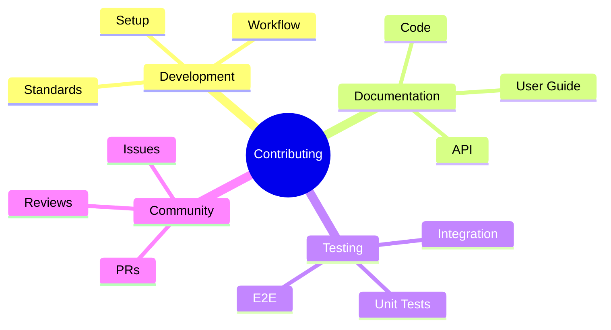
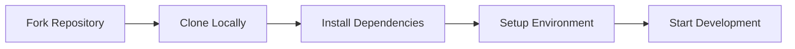
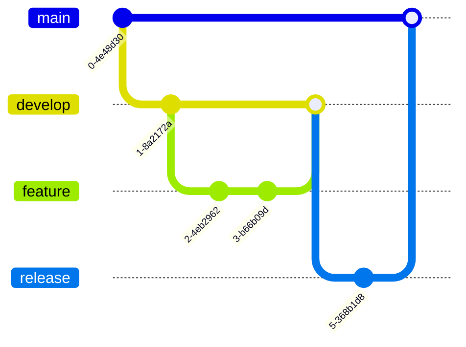
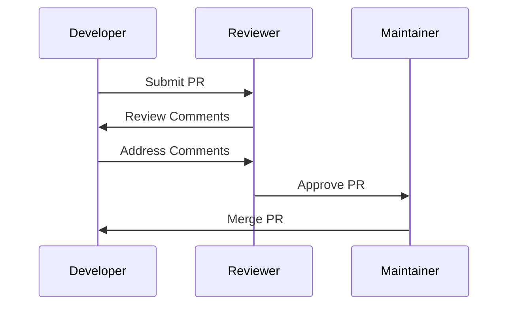
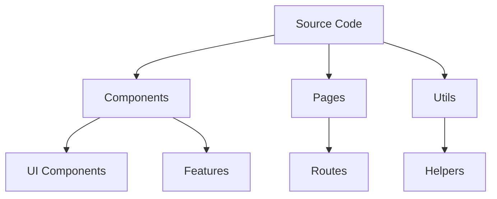
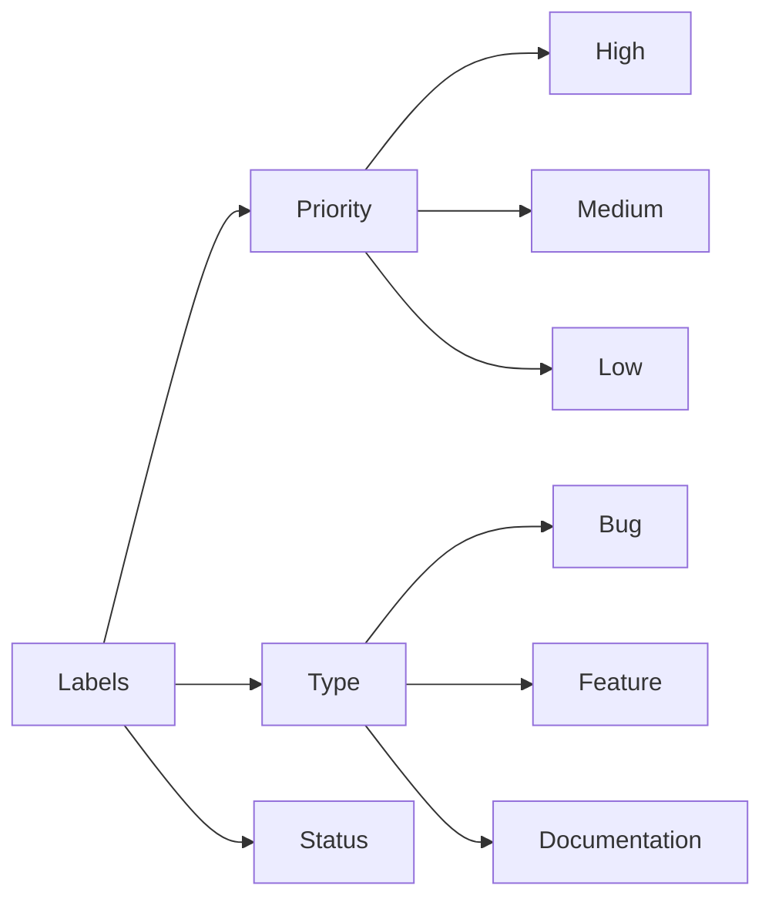

# 🤝 Contributing to InfraBoard

Thank you for your interest in contributing to InfraBoard! This guide will help you get started with contributing to our project.

## 📋 Table of Contents



## 🚀 Getting Started

### Development Environment Setup



1. **Fork and Clone**
   ```bash
   git clone https://github.com/YOUR_USERNAME/InfraBoard.git
   cd InfraBoard
   ```

2. **Install Dependencies**
   ```bash
   npm install
   ```

3. **Environment Setup**
   ```bash
   cp .env.example .env.local
   # Configure your environment variables
   ```

4. **Start Development Server**
   ```bash
   npm run dev
   ```

## 🌿 Branch Strategy



### Branch Naming Convention
- Feature: `feature/your-feature-name`
- Bug Fix: `fix/issue-description`
- Documentation: `docs/what-you-documented`
- Performance: `perf/what-you-optimized`

## 💻 Development Workflow

1. **Create a Branch**
   ```bash
   git checkout -b feature/your-feature-name
   ```

2. **Make Changes**
   - Write clean, maintainable code
   - Follow our coding standards
   - Add tests for new features

3. **Commit Changes**
   ```bash
   git add .
   git commit -m "feat: add new feature"
   ```

   Commit Message Format:
   ```
   type(scope): subject

   body

   footer
   ```

   Types:
   - feat: New feature
   - fix: Bug fix
   - docs: Documentation
   - style: Formatting
   - refactor: Code restructuring
   - test: Adding tests
   - chore: Maintenance

4. **Push Changes**
   ```bash
   git push origin feature/your-feature-name
   ```

## 🔍 Code Review Process



### Pull Request Guidelines

1. **Title Format**:
   ```
   [Type] Brief description
   ```

2. **Description Template**:
   ```markdown
   ## Description
   Brief description of changes

   ## Related Issue
   Fixes #(issue)

   ## Type of Change
   - [ ] Bug fix
   - [ ] New feature
   - [ ] Breaking change
   - [ ] Documentation update

   ## Testing
   Describe tests you ran

   ## Screenshots (if applicable)
   ```

## 🧪 Testing Guidelines

### Test Structure
```typescript
describe('Component/Feature', () => {
  beforeEach(() => {
    // Setup
  })

  it('should behave as expected', () => {
    // Test
  })

  afterEach(() => {
    // Cleanup
  })
})
```

### Running Tests
```bash
# Unit tests
npm run test

# E2E tests
npm run test:e2e

# Coverage report
npm run test:coverage
```

## 📝 Documentation

### Code Documentation
- Use JSDoc comments for functions
- Document complex logic
- Keep README files updated

### API Documentation
- Document all endpoints
- Include request/response examples
- Note any authentication requirements

## 🎯 Project Structure



## 🚦 Quality Guidelines

### Code Quality Checklist
- [ ] Follows coding standards
- [ ] Includes tests
- [ ] Documentation updated
- [ ] No linting errors
- [ ] Passes CI checks
- [ ] Reviewed by peers

### Performance Considerations
- Optimize bundle size
- Minimize re-renders
- Use lazy loading
- Implement caching

## 🤝 Community Guidelines

1. **Be Respectful**
   - Value diverse perspectives
   - Use inclusive language
   - Be constructive in feedback

2. **Communication Channels**
   - GitHub Issues
   - Pull Requests
   - Project Discussions

3. **Support**
   - Help others learn
   - Share knowledge
   - Be patient with newcomers

## 🏷️ Labels and Tags



## 📈 Release Process

1. **Version Bump**
   ```bash
   npm version patch|minor|major
   ```

2. **Changelog Update**
   - Document changes
   - Group by type
   - Include migration guides

3. **Release Creation**
   - Tag release
   - Write release notes
   - Deploy to production

## 🎉 Recognition

Contributors will be:
- Added to CONTRIBUTORS.md
- Mentioned in release notes
- Recognized in project documentation

---

Remember to check our [Code of Conduct](./CODE_OF_CONDUCT.md) and [Templates](./TEMPLATE.md) for more information.

For any questions, feel free to open an issue or join our community discussions.
