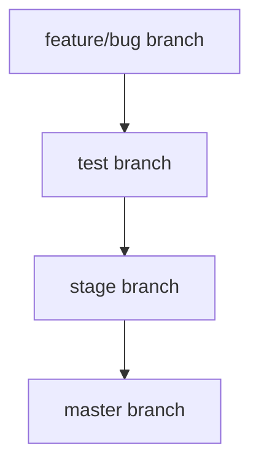
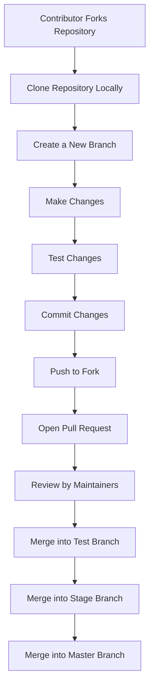

# **Contributing to InfraBoard**

Thank you for your interest in contributing to InfraBoard! This document provides detailed guidelines and processes to ensure your contributions align with the project's standards and workflows.

---

## **Ways to Contribute**

- **Report Bugs**: Identify issues and create detailed reports in our [Issue Tracker](https://github.com/xerocodee/InfraBoard/issues).
- **Suggest Enhancements**: Share ideas to improve InfraBoard by opening a discussion or issue.
- **Code Contributions**: Tackle open issues or suggest new features to enhance InfraBoard's functionality.

---

## **Contribution Workflow**

### **Steps for Contributing**

1. **Fork the Repository**: Fork InfraBoard's repository to your GitHub account.
2. **Clone Your Fork**: Clone the forked repository locally:
   ```bash
   git clone https://github.com/<your-username>/InfraBoard.git
   ```
3. **Create a New Branch**: Use a feature-specific branch name:
   ```bash
   git checkout -b feature/YourFeature
   ```
4. **Make Changes**: Implement your feature or bug fix in the appropriate files.
5. **Test Your Changes**: Ensure your changes pass existing tests and add new ones if necessary.
6. **Commit Changes**: Write clear, descriptive commit messages:
   ```bash
   git commit -m "Add YourFeature"
   ```
7. **Push Changes**: Push your branch to your fork:
   ```bash
   git push origin feature/YourFeature
   ```
8. **Open a Pull Request**: Create a pull request (PR) to merge your branch into InfraBoard's `test` branch.

---

## **GitHub Desktop Workflow**

1. **Open GitHub Desktop**:
   - Log in to your GitHub account.
2. **Clone Repository**:
   - Clone InfraBoard's repository via the "Clone Repository" option.
3. **Switch to a New Branch**:
   - Use the "Current Branch" dropdown to create or switch branches.
4. **Make Changes**:
   - Edit files locally using your preferred editor.
5. **Commit Changes**:
   - Use GitHub Desktop to stage and commit your changes.
6. **Push Changes**:
   - Push your branch to your forked repository.
7. **Create a Pull Request**:
   - Use the "Compare & Pull Request" button on GitHub to open a PR.

---

## **Branching and PR Strategy**

All new features or bug fixes should be made on a separate feature or bug branch. Submit pull requests to the `test` branch for review and testing before merging into the main or stage branch.



---

## **Coding Guidelines**

- Follow the project's coding standards (see `.eslintrc.json` and `.prettierrc`).
- Ensure your code is clean, readable, and maintainable.
- Comment your code where necessary to improve clarity.

---

## **Documentation Guidelines**

If your changes require documentation updates:
- Include documentation updates in your pull request.
- Ensure clarity and consistency in writing.

---

## **Pull Request Guidelines**

- Keep PRs concise and focused on a single feature or fix.
- Provide a clear and detailed description of the changes.
- Reference relevant issue numbers for context.

---

## **Code of Conduct**

By contributing to InfraBoard, you agree to abide by our [Code of Conduct](./CODE_OF_CONDUCT.md). It ensures a welcoming and inclusive environment for all contributors.

---

## **Communication Channels**

If you have questions or need assistance:
- [Discord](https://discord.gg/nmRb3fsTgu)
- [Discussions Room](https://github.com/xerocodee/InfraBoard/discussions)

---

## **Support the Project**

If you find InfraBoard helpful, consider giving it a ⭐️ on GitHub. Your support helps us grow and reach more contributors.

---

## **Mermaid Diagram: Contribution Workflow**



---

Thank you for contributing to InfraBoard! Your contributions make a significant impact on the project's success.