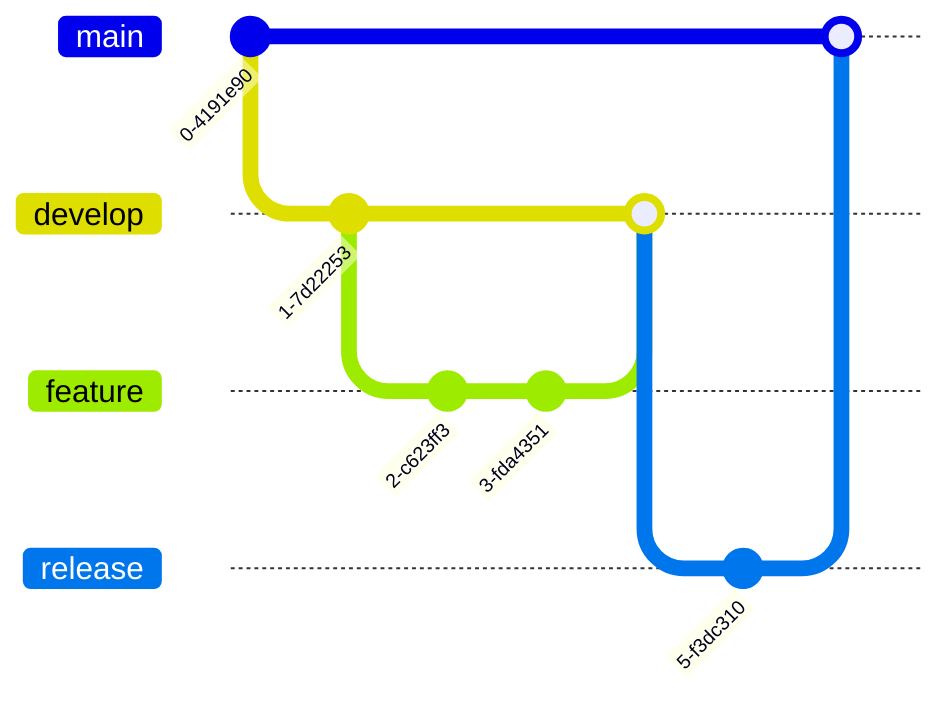

# **Contributing to InfraBoard**

Thank you for your interest in contributing to InfraBoard! This document provides detailed guidelines and processes to ensure your contributions align with the project's standards and workflows.

---

## **Ways to Contribute**

- **Report Bugs**: Identify issues and create detailed reports in our [Issue Tracker](https://github.com/xerocodee/InfraBoard/issues).
- **Suggest Enhancements**: Share ideas to improve InfraBoard by opening a discussion or issue.
- **Code Contributions**: Tackle open issues or suggest new features to enhance InfraBoard's functionality.

---

## **Contribution Workflow**

### **Steps for Contributing**

1. **Fork the Repository**: Fork InfraBoard's repository to your GitHub account.
2. **Clone Your Fork**: Clone the forked repository locally:
   ```bash
   git clone https://github.com/<your-username>/InfraBoard.git
   ```
3. **Create a New Branch**: Use a feature-specific branch name:
   ```bash
   git checkout -b feature/YourFeature
   ```
4. **Make Changes**: Implement your feature or bug fix in the appropriate files.
5. **Test Your Changes**: Ensure your changes pass existing tests and add new ones if necessary.
6. **Commit Changes**: Write clear, descriptive commit messages:
   ```bash
   git commit -m "Add YourFeature"
   ```
7. **Push Changes**: Push your branch to your fork:
   ```bash
   git push origin feature/YourFeature
   ```
8. **Open a Pull Request**: Create a pull request (PR) to merge your branch into InfraBoard's `test` branch.

---

## **GitHub Desktop Workflow**

1. **Open GitHub Desktop**:
   - Log in to your GitHub account.
2. **Clone Repository**:
   - Clone InfraBoard's repository via the "Clone Repository" option.
3. **Switch to a New Branch**:
   - Use the "Current Branch" dropdown to create or switch branches.
4. **Make Changes**:
   - Edit files locally using your preferred editor.
5. **Commit Changes**:
   - Use GitHub Desktop to stage and commit your changes.
6. **Push Changes**:
   - Push your branch to your forked repository.
7. **Create a Pull Request**:
   - Use the "Compare & Pull Request" button on GitHub to open a PR.

---

## **Branching and PR Strategy**

All new features or bug fixes should be made on a separate feature or bug branch. Submit pull requests to the `test` branch for review and testing before merging into the main or stage branch.


---

## **Coding Guidelines**

- Follow the project's coding standards (see `.eslintrc.json` and `.prettierrc`).
- Ensure your code is clean, readable, and maintainable.
- Comment your code where necessary to improve clarity.

---

## **Documentation Guidelines**

If your changes require documentation updates:
- Include documentation updates in your pull request.
- Ensure clarity and consistency in writing.

---

## **Pull Request Guidelines**

- Keep PRs concise and focused on a single feature or fix.
- Provide a clear and detailed description of the changes.
- Reference relevant issue numbers for context.

---

## **Code of Conduct**

By contributing to InfraBoard, you agree to abide by our [Code of Conduct](./CODE_OF_CONDUCT.md). It ensures a welcoming and inclusive environment for all contributors.

---

## **Communication Channels**

If you have questions or need assistance:
- [Discord](https://discord.gg/nmRb3fsTgu)
- [Discussions Room](https://github.com/xerocodee/InfraBoard/discussions)

---

## **Support the Project**

If you find InfraBoard helpful, consider giving it a ⭐️ on GitHub. Your support helps us grow and reach more contributors.

---

## **Mermaid Diagram: Contribution Workflow**


---

Thank you for contributing to InfraBoard! Your contributions make a significant impact on the project's success.
=======
# 🤝 Contributing to InfraBoard

Thank you for your interest in contributing to InfraBoard! This guide will help you get started with contributing to our project.

## 📋 Table of Contents


## 🚀 Getting Started

### Development Environment Setup


1. **Fork and Clone**
   ```bash
   git clone https://github.com/YOUR_USERNAME/InfraBoard.git
   cd InfraBoard
   ```

2. **Install Dependencies**
   ```bash
   npm install
   ```

3. **Environment Setup**
   ```bash
   cp .env.example .env.local
   # Configure your environment variables
   ```

4. **Start Development Server**
   ```bash
   npm run dev
   ```

## 🌿 Branch Strategy



### Branch Naming Convention
- Feature: `feature/your-feature-name`
- Bug Fix: `fix/issue-description`
- Documentation: `docs/what-you-documented`
- Performance: `perf/what-you-optimized`

## 💻 Development Workflow

1. **Create a Branch**
   ```bash
   git checkout -b feature/your-feature-name
   ```

2. **Make Changes**
   - Write clean, maintainable code
   - Follow our coding standards
   - Add tests for new features

3. **Commit Changes**
   ```bash
   git add .
   git commit -m "feat: add new feature"
   ```

   Commit Message Format:
   ```
   type(scope): subject

   body

   footer
   ```

   Types:
   - feat: New feature
   - fix: Bug fix
   - docs: Documentation
   - style: Formatting
   - refactor: Code restructuring
   - test: Adding tests
   - chore: Maintenance

4. **Push Changes**
   ```bash
   git push origin feature/your-feature-name
   ```

## 🔍 Code Review Process


### Pull Request Guidelines

1. **Title Format**:
   ```
   [Type] Brief description
   ```

2. **Description Template**:
   ```markdown
   ## Description
   Brief description of changes

   ## Related Issue
   Fixes #(issue)

   ## Type of Change
   - [ ] Bug fix
   - [ ] New feature
   - [ ] Breaking change
   - [ ] Documentation update

   ## Testing
   Describe tests you ran

   ## Screenshots (if applicable)
   ```

## 🧪 Testing Guidelines

### Test Structure
```typescript
describe('Component/Feature', () => {
  beforeEach(() => {
    // Setup
  })

  it('should behave as expected', () => {
    // Test
  })

  afterEach(() => {
    // Cleanup
  })
})
```

### Running Tests
```bash
# Unit tests
npm run test

# E2E tests
npm run test:e2e

# Coverage report
npm run test:coverage
```

## 📝 Documentation

### Code Documentation
- Use JSDoc comments for functions
- Document complex logic
- Keep README files updated

### API Documentation
- Document all endpoints
- Include request/response examples
- Note any authentication requirements

## 🎯 Project Structure


## 🚦 Quality Guidelines

### Code Quality Checklist
- [ ] Follows coding standards
- [ ] Includes tests
- [ ] Documentation updated
- [ ] No linting errors
- [ ] Passes CI checks
- [ ] Reviewed by peers

### Performance Considerations
- Optimize bundle size
- Minimize re-renders
- Use lazy loading
- Implement caching

## 🤝 Community Guidelines

1. **Be Respectful**
   - Value diverse perspectives
   - Use inclusive language
   - Be constructive in feedback

2. **Communication Channels**
   - GitHub Issues
   - Pull Requests
   - Project Discussions

3. **Support**
   - Help others learn
   - Share knowledge
   - Be patient with newcomers

## 🏷️ Labels and Tags


## 📈 Release Process

1. **Version Bump**
   ```bash
   npm version patch|minor|major
   ```

2. **Changelog Update**
   - Document changes
   - Group by type
   - Include migration guides

3. **Release Creation**
   - Tag release
   - Write release notes
   - Deploy to production

## 🎉 Recognition

Contributors will be:
- Added to CONTRIBUTORS.md
- Mentioned in release notes
- Recognized in project documentation

---

Remember to check our [Code of Conduct](./CODE_OF_CONDUCT.md) and [Templates](./TEMPLATE.md) for more information.

For any questions, feel free to open an issue or join our community discussions.