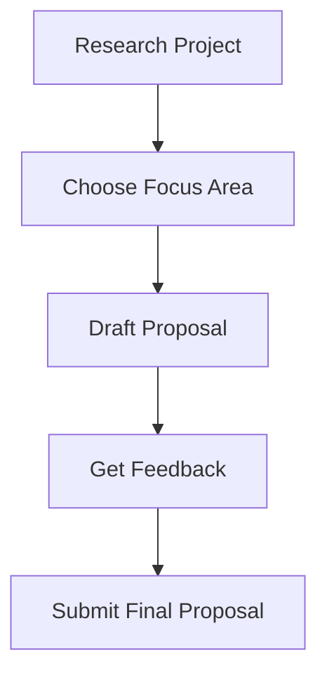
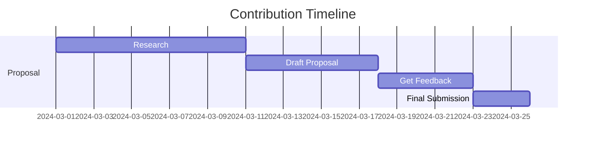

# 📝 InfraBoard Contributor Guide

Welcome to InfraBoard! This guide will help you create a successful proposal and contribute effectively to our project.

## 🎯 Writing a Successful Proposal



### 1. Proposal Structure

Your proposal should include:

```markdown
# Project Title

## Overview
- Brief project description
- Problem being solved
- Expected impact

## Technical Details
- Implementation approach
- Technologies used
- Architecture overview

## Timeline
- Week-by-week breakdown
- Milestones
- Deliverables

## About You
- Relevant experience
- Why you're interested
- GitHub/portfolio links
```

### 2. Focus Areas

We're particularly interested in proposals that address:

- 🎨 Infrastructure Visualization
- 🔄 Multi-Cloud Integration
- 🛠️ Terraform Enhancement
- 📊 Analytics & Monitoring
- 🤝 Collaboration Features

### 3. Evaluation Criteria

We evaluate proposals based on:

- Technical feasibility
- Project impact
- Implementation clarity
- Your experience
- Communication skills

## 🤝 Getting Started

1. **Research**
   - Read our [documentation](./README.md)
   - Understand our [architecture](./STRUCTURE.md)
   - Review existing [issues](https://github.com/xerocodee/InfraBoard/issues)

2. **Connect**
   - Join project discussions
   - Ask questions
   - Share your ideas

3. **Contribute**
   - Make small contributions
   - Familiarize with codebase
   - Follow our [guidelines](./CONTRIBUTING.md)

## 📋 Proposal Requirements

### Must Have
- [ ] Clear project goals
- [ ] Detailed implementation plan
- [ ] Realistic timeline
- [ ] Technical specifications
- [ ] Testing strategy
- [ ] Documentation plan

### Good to Have
- [ ] Mock-ups/wireframes
- [ ] Risk assessment
- [ ] Alternative approaches
- [ ] Performance considerations
- [ ] Security considerations

## 💡 Tips for Success

1. **Research Thoroughly**
   - Understand our existing codebase
   - Identify real problems to solve
   - Propose realistic solutions

2. **Be Specific**
   - Provide detailed technical plans
   - Include concrete examples
   - Set clear milestones

3. **Show Initiative**
   - Make small contributions first
   - Engage in discussions
   - Ask thoughtful questions

4. **Communicate Clearly**
   - Regular updates
   - Clear documentation
   - Responsive to feedback

## 🗓️ Timeline



## 📞 Communication

### Primary Channels
- GitHub Issues
- Project Discussions
- Pull Requests

### Best Practices
1. **Be Clear and Concise**
2. **Include Context**
3. **Follow Templates**
4. **Be Responsive**

## 🎓 Resources

1. **Technical Resources**
   - [Next.js Documentation](https://nextjs.org/docs)
   - [Terraform Guides](https://learn.hashicorp.com/terraform)
   - [TypeScript Handbook](https://www.typescriptlang.org/docs/)

2. **Project Documentation**
   - [Architecture Guide](./STRUCTURE.md)
   - [Contributing Guide](./CONTRIBUTING.md)
   - [Code of Conduct](./CODE_OF_CONDUCT.md)

## 🚀 Next Steps

1. **Review Documentation**
   - Read through our guides
   - Understand our architecture
   - Review coding standards

2. **Choose Project**
   - Select area of interest
   - Review existing issues
   - Discuss with maintainers

3. **Start Contributing**
   - Make small fixes
   - Submit pull requests
   - Engage with community

---

Remember: A successful proposal demonstrates both your technical capability and your understanding of our project's goals and values.

For questions or clarifications, feel free to open an issue or join our discussions. 