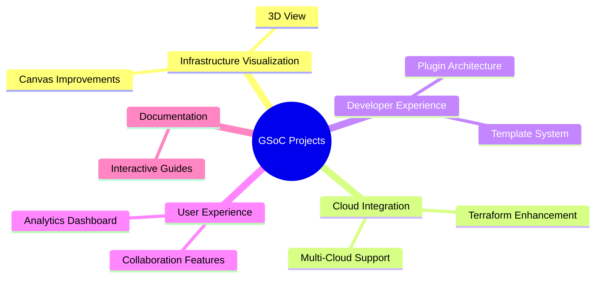
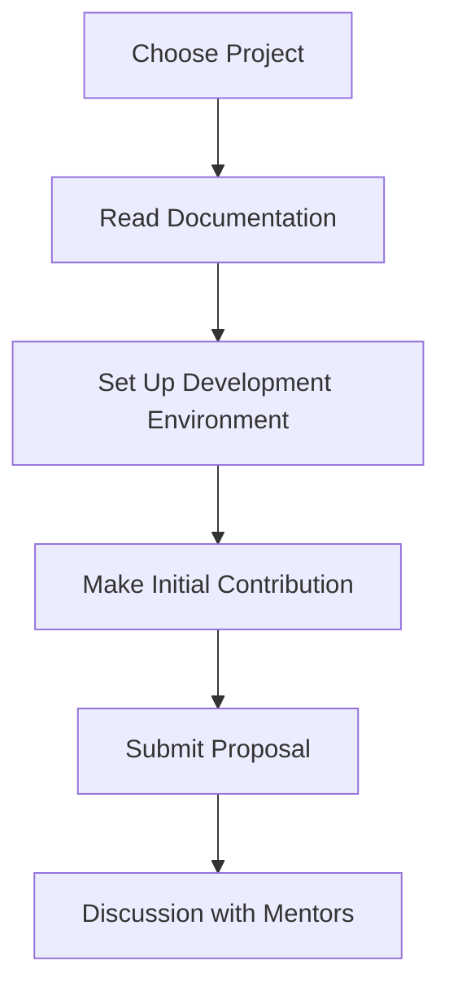

# 🌟 Google Summer of Code 2025 - InfraBoard Project Ideas

Welcome to InfraBoard's GSoC 2025 project ideas page! Below you'll find exciting projects that combine cloud infrastructure, visualization, and modern web technologies.

## 📋 Table of Contents

## 🚀 Project Ideas

### 1. Enhanced Infrastructure Visualization Engine

**Title**: Advanced Canvas Visualization System  
**Description**: Create a more powerful visualization engine for cloud infrastructure components with advanced features like auto-layout, grouping, and relationship mapping.

**Goals & Ideas**:
- Implement smart auto-layout algorithms
- Add component grouping and nesting
- Create visual relationship mapping
- Develop custom SVG rendering system

**Skills Required**:
- React.js/Next.js
- Canvas/SVG manipulation
- TypeScript
- Algorithms knowledge

**Time Estimate**: 350 hours  
**Difficulty**: Medium

### 2. 3D Infrastructure Visualization

**Title**: 3D Cloud Infrastructure Viewer  
**Description**: Develop a 3D visualization system for cloud infrastructure, allowing users to view their architecture from different angles and levels.

**Goals & Ideas**:
- Implement Three.js integration
- Create 3D models for cloud components
- Add camera controls and navigation
- Develop level-of-detail system

**Skills Required**:
- Three.js
- WebGL
- JavaScript/TypeScript
- 3D modeling concepts

**Time Estimate**: 350 hours  
**Difficulty**: Hard

### 3. Multi-Cloud Resource Manager

**Title**: Universal Cloud Resource Management  
**Description**: Create a unified interface for managing resources across multiple cloud providers (AWS, GCP, Azure).

**Goals & Ideas**:
- Implement unified API layer
- Create provider-agnostic models
- Develop resource mapping system
- Add real-time monitoring

**Skills Required**:
- Cloud APIs (AWS, GCP, Azure)
- REST API design
- TypeScript
- System architecture

**Time Estimate**: 350 hours  
**Difficulty**: Medium

### 4. Infrastructure Template System

**Title**: Smart Infrastructure Templates  
**Description**: Develop an intelligent template system for common infrastructure patterns with customization options.

**Goals & Ideas**:
- Create template authoring system
- Implement variable substitution
- Add validation rules
- Develop template marketplace

**Skills Required**:
- JavaScript/TypeScript
- Infrastructure as Code
- Template design
- UX design

**Time Estimate**: 350 hours  
**Difficulty**: Medium

### 5. Real-time Collaboration System

**Title**: Collaborative Infrastructure Design  
**Description**: Implement real-time collaboration features allowing multiple users to work on infrastructure designs simultaneously.

**Goals & Ideas**:
- Add real-time editing
- Implement conflict resolution
- Create presence indicators
- Add commenting system

**Skills Required**:
- WebSocket
- Operational Transformation
- React.js
- State management

**Time Estimate**: 350 hours  
**Difficulty**: Hard

### 6. Infrastructure Analytics Dashboard

**Title**: Cloud Resource Analytics  
**Description**: Create a comprehensive analytics dashboard for monitoring cloud resource usage, costs, and performance.

**Goals & Ideas**:
- Implement data collection system
- Create visualization components
- Add cost prediction
- Develop recommendation engine

**Skills Required**:
- Data visualization
- Analytics
- React.js
- Cloud APIs

**Time Estimate**: 350 hours  
**Difficulty**: Medium

### 7. Plugin Architecture System

**Title**: Extensible Plugin System  
**Description**: Design and implement a plugin system allowing third-party developers to extend InfraBoard's functionality.

**Goals & Ideas**:
- Create plugin API
- Implement sandbox environment
- Add plugin marketplace
- Develop documentation system

**Skills Required**:
- Plugin architecture
- JavaScript/TypeScript
- API design
- Security concepts

**Time Estimate**: 350 hours  
**Difficulty**: Hard

### 8. Interactive Documentation System

**Title**: Interactive Learning Platform  
**Description**: Build an interactive documentation and learning system for cloud infrastructure concepts.

**Goals & Ideas**:
- Create interactive tutorials
- Implement code playgrounds
- Add progress tracking
- Develop assessment system

**Skills Required**:
- React.js
- Documentation tools
- UX design
- Technical writing

**Time Estimate**: 350 hours  
**Difficulty**: Medium

### 9. Infrastructure Testing Framework

**Title**: Automated Infrastructure Testing  
**Description**: Develop a framework for testing infrastructure configurations before deployment.

**Goals & Ideas**:
- Implement test runner
- Create assertion library
- Add mock system
- Develop reporting system

**Skills Required**:
- Testing frameworks
- Infrastructure as Code
- JavaScript/TypeScript
- CI/CD concepts

**Time Estimate**: 350 hours  
**Difficulty**: Medium

### 10. Cost Optimization Engine

**Title**: Smart Cost Optimization  
**Description**: Create an intelligent system for analyzing and optimizing cloud infrastructure costs.

**Goals & Ideas**:
- Implement cost analysis
- Create optimization algorithms
- Add recommendation system
- Develop reporting tools

**Skills Required**:
- Cloud pricing models
- Optimization algorithms
- Data analysis
- React.js

**Time Estimate**: 350 hours  
**Difficulty**: Medium

## 🤝 Application Process

## 📝 Proposal Guidelines

1. **Project Understanding**: Show that you understand the project's goals
2. **Technical Details**: Provide implementation details
3. **Timeline**: Break down the work into weekly milestones
4. **Previous Experience**: Highlight relevant skills and experience
5. **Communication**: Explain how you'll work with mentors

## 📞 Contact

- GitHub Discussions

---

Remember to check our [Contributing Guidelines](./CONTRIBUTING.md) and [Code of Conduct](./CODE_OF_CONDUCT.md) before applying.
