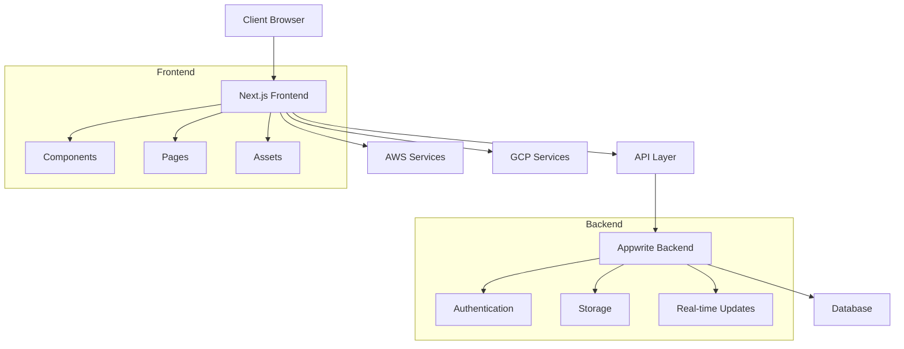
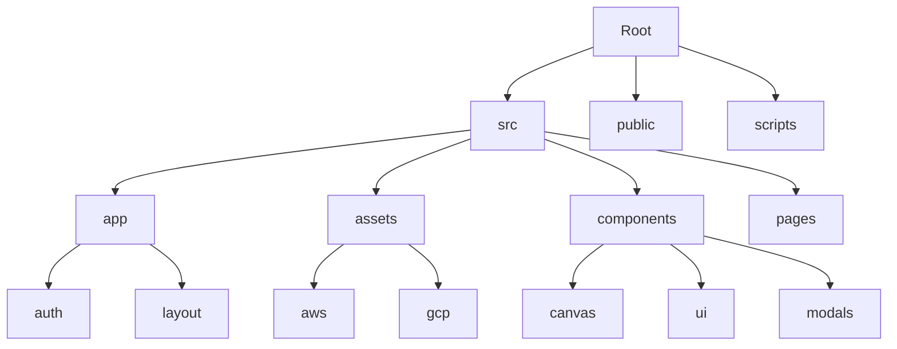

<p align="center"></p>

<h2 align="center">InfraBoard - Visual Cloud Infrastructure Management</h2>

<p align="center">
  <a href="https://github.com/xerocodee/InfraBoard/blob/master/LICENSE">
    
  </a>
  <a href="https://github.com/xerocodee/InfraBoard/stargazers">
    
  </a>
  <a href="https://github.com/xerocodee/InfraBoard/network">
    
  </a>
</p>

Welcome to InfraBoard, the end-to-end solution for visually building and managing cloud infrastructures. Simplify your infrastructure management with our intuitive, collaborative, and innovative tool.

## 📋 Table of Contents

- [Features](#-features)
- [Architecture](#-architecture)
- [Project Structure](#-project-structure)
- [Getting Started](#-getting-started)
- [InfraBoard & Terraform](#%EF%B8%8F-infraboard--terraform)
- [Why InfraBoard?](#-why-infraboard)
- [How It Works](#-how-it-works)
- [Contributing](#-contributing)
- [License](#-license)

## 🌟 Features

- **Visual Interface**: Design your cloud architecture visually and let InfraBoard auto-generate the code.
- **Seamless Automation**: Integrate easily with existing processes, accelerating automation.
- **Centralized Management**: Manage all your cloud infrastructures in one place.
- **Efficiency & Templates**: Utilize our DRY architecture templates and integrated CI/CD engine.
- **Standardization & Best Practices**: Streamline your processes with embedded best practices.

## 🏗 Architecture



## 📁 Project Structure



## 🚀 Getting Started

1. **Clone the repository**
```bash
git clone https://github.com/xerocodee/InfraBoard.git
cd InfraBoard
```

2. **Install dependencies**
```bash
npm install
```

3. **Set up environment variables**
```bash
cp .env.example .env.local
```

4. **Run development server**
```bash
npm run dev
```

### Demo Credentials
- Email: `test@xerocodee.com`
- Password: `test@123`

## ⚙️ InfraBoard & Terraform

Leverage the power of Terraform without the hassle of manual coding. InfraBoard uses Terraform as an execution layer, offering an efficient ecosystem for managing cloud infrastructures.

## 🎯 Why InfraBoard?

- Migrate to IaC & Terraform with ease
- Standardize your cloud infrastructure processes
- Real-time documentation and version tracking
- Multi-cloud design capabilities
- Build trust with clear, documented processes
- Integrated best practices and CI/CD engine
- Save time across various operations

## 🛠 How It Works

InfraBoard combines synchronous and asynchronous services for a streamlined experience:
- Frontend uses CDNs for low latency
- Backend spans key global regions
- Real-time collaboration features
- Automated code generation

## 🤝 Contributing

We welcome contributions! Check out our:
- [Contributing Guidelines](./CONTRIBUTING.md)
- [Code Structure](./STRUCTURE.md)
- [Code of Conduct](./CODE_OF_CONDUCT.md)

### Preview Environments
- [Master](https://master.d168r6ki0y08e.amplifyapp.com)
- [Stage](https://stage.d168r6ki0y08e.amplifyapp.com)
- [Test](https://test.d168r6ki0y08e.amplifyapp.com)

## 📄 License

Distributed under the [Apache License 2.0](./LICENSE).

---

<p align="center">Made with ❤️ by the InfraBoard Team</p>
