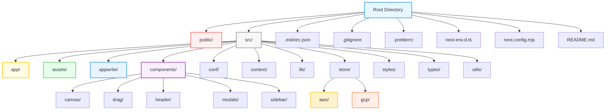
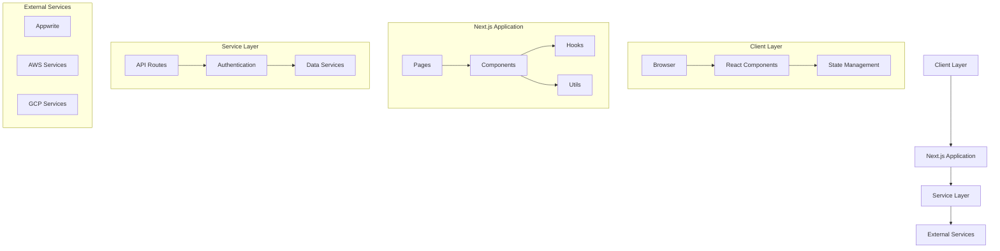
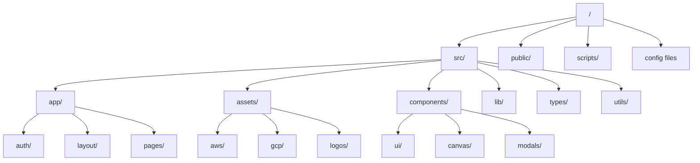
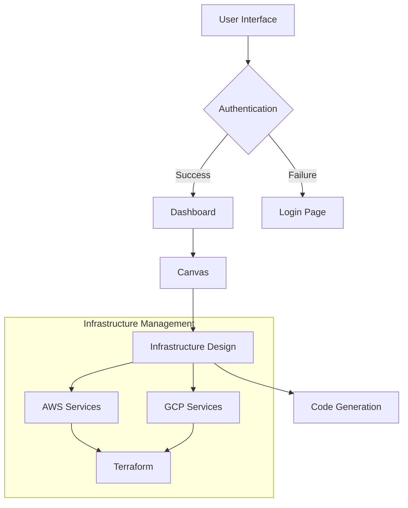
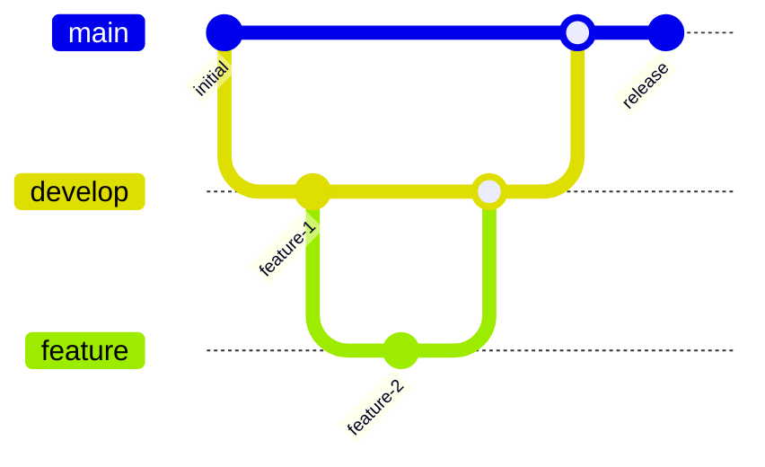

# InfraBoard File Structure

This document provides a professional overview of the **InfraBoard** project's file structure to help navigate and understand where different parts of the codebase reside. It adheres to modular and organized conventions for maintainability and scalability.

## Overview of the Structure

- **`public/`**: Contains static assets such as images and `favicon.ico` used across the application.
- **`src/`**: Houses the main application source code:
  - **`app/`**: Core files for global styles and layout definitions.
  - **`assets/`**: Categorized asset files (e.g., AWS, GCP, logos).
  - **`appwrite/`**: Includes functions for Appwrite authentication.
  - **`components/`**: Reusable React components:
    - **`canvas/`**: Components for canvas-related functionality.
    - **`drag/`**: Drag-and-drop related components.
    - **`header/`**: Components for the application header.
    - **`modals/`**: Modal components such as `ReadmeModal.tsx`.
    - **`sidebar/`**: Sidebar and related components.
  - **`conf/`**: Configuration files for Appwrite project credentials.
  - **`context/`**: Global context state management files.
  - **`lib/`**: Library files utilized throughout the project.
  - **`store/`**: State management implementations (e.g., Redux) categorized by service type:
    - **`store/aws/`**: AWS service-specific state management.
    - **`store/gcp/`**: GCP service-specific state management.
  - **`styles/`**: CSS files for styling the project.
  - **`types/`**: TypeScript interface and type definition files.
  - **`utils/`**: Utility functions reused across the project:
    - **`protectedRoutes.tsx`**: Ensures authenticated access to InfraBoard's Dashboard.
- **Configuration Files**:
  - `.eslintrc.json`: ESLint configuration for coding standards.
  - `.gitignore`: Files and directories to be ignored by Git.
  - `.prettierrc`: Prettier configuration for consistent code formatting.
  - `next-env.d.ts`: Type declarations for Next.js.
  - `next.config.mjs`: Next.js configuration.
  - `README.md`: Comprehensive guide and project overview.

---

## File Structure Visualization

---

## Key Notes

1. **Protected Routes**: The `protectedRoutes.tsx` file ensures that only authenticated users can access the InfraBoard Dashboard.
2. **State Management**: The `store/` directory provides service-specific state management to segregate concerns effectively.
3. **Scalability**: The modular structure supports future scalability and integration of additional services or components.
4. **Consistency**: Configuration files like `.eslintrc.json` and `.prettierrc` maintain coding standards and formatting consistency.
=======
# 📁 InfraBoard Project Structure

This document provides a comprehensive overview of the InfraBoard project's file structure and architecture.

## 🏗 Application Architecture

## 📂 Directory Structure

## 📁 Core Directories

### `/src`
The main source code directory containing the application logic.

#### `/app`
Next.js 13+ app directory structure:
- `/auth` - Authentication related pages
- `/layout` - Layout components and templates
- `/pages` - Application pages and routes

#### `/assets`
Static assets and icon components:
- `/aws` - AWS service icons and assets
- `/gcp` - GCP service icons and assets
- `/logos` - Brand and service logos

#### `/components`
Reusable React components:
- `/canvas` - Drag-and-drop canvas components
- `/ui` - UI components (buttons, inputs, etc.)
- `/modals` - Modal dialog components

#### `/lib`
Core libraries and utilities:
- `utils.ts` - Utility functions
- `types.ts` - TypeScript type definitions

### `/public`
Static files served directly:
- Images
- Fonts
- Favicon
- robots.txt
- sitemap.xml

### `/scripts`
Build and maintenance scripts:
- `generate-robots.js`
- `generate-sitemap.js`

## 🔧 Configuration Files

- `.env.example` - Environment variables template
- `.eslintrc.json` - ESLint configuration
- `.prettierrc` - Prettier configuration
- `next.config.mjs` - Next.js configuration
- `tailwind.config.ts` - Tailwind CSS configuration
- `tsconfig.json` - TypeScript configuration

## 🚀 Key Features Implementation

## 📦 Component Organization

Components are organized following atomic design principles:

1. **Atoms**: Basic UI components
   - Buttons
   - Inputs
   - Icons

2. **Molecules**: Combinations of atoms
   - Form fields
   - Search bars
   - Cards

3. **Organisms**: Complex UI sections
   - Navigation
   - Sidebars
   - Canvas tools

4. **Templates**: Page layouts
   - Dashboard layout
   - Authentication layout
   - Canvas layout

5. **Pages**: Complete pages
   - Home
   - Dashboard
   - Settings

## 🔄 State Management

The application uses various state management approaches:

1. **Local State**: React's useState
2. **Context API**: For shared state
3. **Server State**: Next.js server components

## 🛠 Development Workflow

For more detailed information about contributing to specific areas of the codebase, please refer to our [Contributing Guidelines](./CONTRIBUTING.md).