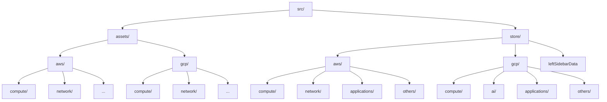

# Templates Tutorial

This document provides detailed instructions on the structure and usage of assets and the store folder in the InfraBoard project, along with a step-by-step guide for creating and using custom `.tsx` icon components.

## **Directory Overview**

### **`src/assets/`**
- **`aws/`**: Contains `.tsx` icon components related to AWS services:
  - **`compute/`**: Icons for AWS compute services.
  - **`network/`**: Icons for AWS networking services.
  - _(Other subdirectories for additional AWS categories)_
- **`gcp/`**: Contains `.tsx` icon components related to GCP services:
  - **`compute/`**: Icons for GCP compute services.
  - **`network/`**: Icons for GCP networking services.
  - _(Other subdirectories for additional GCP categories)_

---

## **Steps to Create a `.tsx` File from an SVG**

1. Copy the SVG code.
2. Open the [SVGR Playground](https://react-svgr.com/playground/?dimensions=false&jsxRuntime=automatic).
3. Paste the SVG code into the playground. It will generate a React component.
4. Save the generated code into a new `.tsx` file within the appropriate directory in `src/assets/`.
5. Follow proper naming conventions for the file.
6. Import the newly created `.tsx` file into `src/assets/index.ts`.
7. Add the new component to the relevant icon object.

---

## **Using the Icon/Image Component**

1. Import the desired icon object:
   ```typescript
   import { AWSIcons } from '@/assets/aws';
   ```
2. Destructure the required icon from the object:
   ```typescript
   const { YourIconComponentName } = AWSIcons;
   ```
3. Use the component in your application:
   ```jsx
   <YourIconComponentName className="" />
   ```

---

## **Store Folder Structure**

### **`src/store/`**
- **`aws/`**: Contains data files related to AWS services, categorized into:
  - **`compute/`**
  - **`network/`**
  - **`applications/`**
  - **`others/`**
  - _(Additional categories as required)_
- **`gcp/`**: Contains data files related to GCP services, categorized into:
  - **`compute/`**
  - **`ai/`**
  - **`applications/`**
  - **`others/`**
  - _(Additional categories as required)_

Each subdirectory contains objects that may include React icons or custom `.tsx` icon components. These objects are imported into `store/aws/index.ts` and `store/gcp/index.ts` for centralized access.

### Key File:
- **`leftSidebarData`**: Responsible for rendering the tabs in the left sidebar. Tabs can be easily added or removed by modifying this file.

---

## **Mermaid Diagram: Directory Visualization**



---

## **Best Practices**

- Maintain a clear and consistent naming convention for all files and components.
- Regularly update the `index.ts` files for centralized imports and better modularity.
- Use the `leftSidebarData` file for managing the tabs dynamically in the left sidebar.
