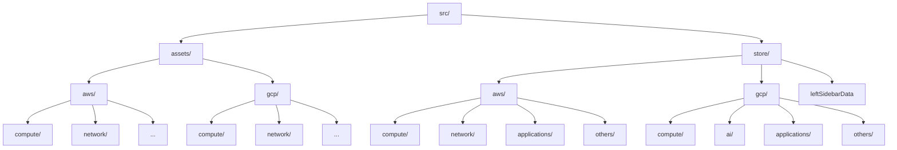
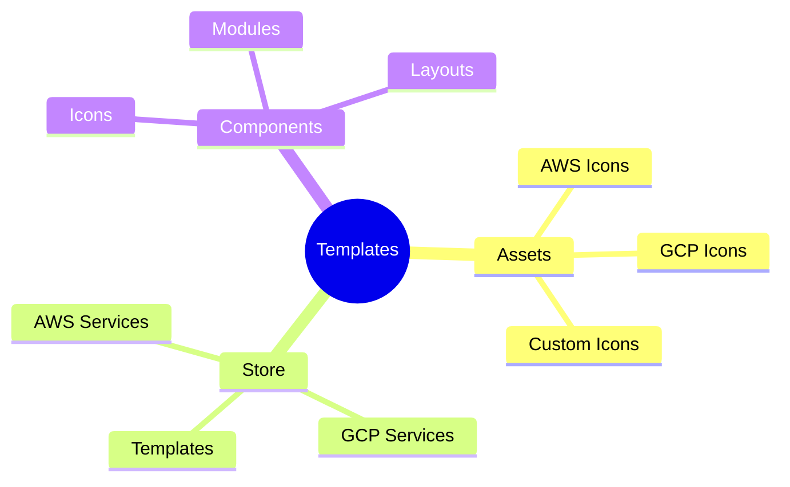
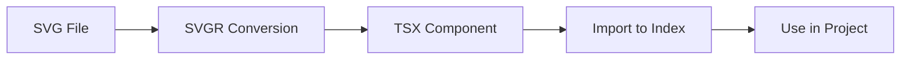
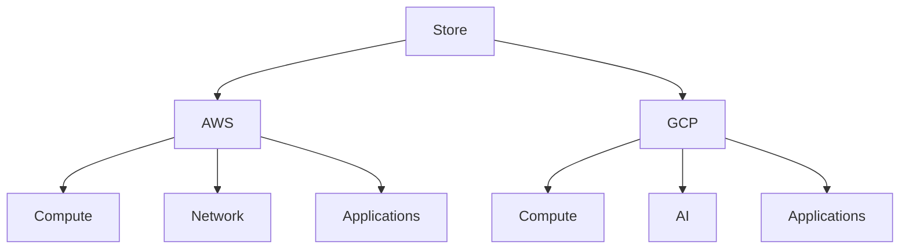

# Templates Tutorial

This document provides detailed instructions on the structure and usage of assets and the store folder in the InfraBoard project, along with a step-by-step guide for creating and using custom `.tsx` icon components.

## **Directory Overview**

### **`src/assets/`**
- **`aws/`**: Contains `.tsx` icon components related to AWS services:
  - **`compute/`**: Icons for AWS compute services.
  - **`network/`**: Icons for AWS networking services.
  - _(Other subdirectories for additional AWS categories)_
- **`gcp/`**: Contains `.tsx` icon components related to GCP services:
  - **`compute/`**: Icons for GCP compute services.
  - **`network/`**: Icons for GCP networking services.
  - _(Other subdirectories for additional GCP categories)_

---

## **Steps to Create a `.tsx` File from an SVG**

1. Copy the SVG code.
2. Open the [SVGR Playground](https://react-svgr.com/playground/?dimensions=false&jsxRuntime=automatic).
3. Paste the SVG code into the playground. It will generate a React component.
4. Save the generated code into a new `.tsx` file within the appropriate directory in `src/assets/`.
5. Follow proper naming conventions for the file.
6. Import the newly created `.tsx` file into `src/assets/index.ts`.
7. Add the new component to the relevant icon object.

---

## **Using the Icon/Image Component**

1. Import the desired icon object:
   ```typescript
   import { AWSIcons } from '@/assets/aws';
   ```
2. Destructure the required icon from the object:
   ```typescript
   const { YourIconComponentName } = AWSIcons;
   ```
3. Use the component in your application:
   ```jsx
   <YourIconComponentName className="" />
   ```

---

## **Store Folder Structure**

### **`src/store/`**
- **`aws/`**: Contains data files related to AWS services, categorized into:
  - **`compute/`**
  - **`network/`**
  - **`applications/`**
  - **`others/`**
  - _(Additional categories as required)_
- **`gcp/`**: Contains data files related to GCP services, categorized into:
  - **`compute/`**
  - **`ai/`**
  - **`applications/`**
  - **`others/`**
  - _(Additional categories as required)_

Each subdirectory contains objects that may include React icons or custom `.tsx` icon components. These objects are imported into `store/aws/index.ts` and `store/gcp/index.ts` for centralized access.

### Key File:
- **`leftSidebarData`**: Responsible for rendering the tabs in the left sidebar. Tabs can be easily added or removed by modifying this file.

---

## **Mermaid Diagram: Directory Visualization**



---

## **Best Practices**

- Maintain a clear and consistent naming convention for all files and components.
- Regularly update the `index.ts` files for centralized imports and better modularity.
- Use the `leftSidebarData` file for managing the tabs dynamically in the left sidebar.
=======
# 📚 InfraBoard Templates Guide

A comprehensive guide for working with templates and assets in the InfraBoard project.

## 📋 Table of Contents



## 🎨 Asset Management

### Icon Creation Process



### Steps to Create Icon Components

1. **Convert SVG to TSX**:
   - Copy the SVG code
   - Visit [SVGR Playground](https://react-svgr.com/playground/?dimensions=false&jsxRuntime=automatic)
   - Paste SVG code and get React component
   - Create icon file using proper naming conventions

2. **Component Integration**:
   ```typescript
   // Example icon component
   import { IconInterface } from '@/assets/iconInterface'
   import React from 'react'
   
   function CustomIcon({ className }: IconInterface) {
     return (
       <svg className={className}>
         {/* SVG content */}
       </svg>
     )
   }
   
   export default React.memo(CustomIcon)
   ```

3. **Index Registration**:
   ```typescript
   // src/assets/index.ts
   import CustomIcon from './path/to/icon'
   
   export const Icons = {
     CustomIcon,
     // ... other icons
   }
   ```

## 📁 Directory Structure

### AWS Assets (`src/assets/aws/`)
```
aws/
├── compute/
│   ├── ec2Icon.tsx
│   ├── lambdaIcon.tsx
│   └── ...
├── network/
│   ├── vpcIcon.tsx
│   └── ...
└── index.ts
```

### GCP Assets (`src/assets/gcp/`)
```
gcp/
├── compute/
│   ├── vmIcon.tsx
│   └── ...
├── network/
│   └── ...
└── index.ts
```

## 🏗 Store Organization



### Store Structure
- `store/aws/`: AWS service definitions
  - `compute/`
  - `network/`
  - `applications/`
  - `others/`
- `store/gcp/`: GCP service definitions
  - `compute/`
  - `ai/`
  - `applications/`
  - `others/`

## 💻 Usage Examples

### Using Icons
```typescript
import { AWSIcons } from '@/assets/aws'

const { EC2Icon } = AWSIcons

function Component() {
  return <EC2Icon className="w-6 h-6" />
}
```

### Left Sidebar Data
```typescript
// Example sidebar configuration
const leftSidebarData = {
  compute: {
    title: 'Compute',
    items: [
      {
        name: 'EC2',
        icon: EC2Icon,
        // ... other properties
      }
    ]
  }
  // ... other categories
}
```

## 🔧 Best Practices

1. **Icon Naming**:
   - Use PascalCase for component names
   - Append 'Icon' suffix to icon components
   - Group related icons in appropriate directories

2. **Component Organization**:
   ```mermaid
   graph TD
       A[Components] --> B[Atomic Design]
       B --> C[Atoms]
       B --> D[Molecules]
       B --> E[Organisms]
       C --> F[Icons]
       C --> G[Buttons]
       D --> H[Cards]
       E --> I[Sections]
   ```

3. **File Structure**:
   - Keep related files together
   - Use index files for exports
   - Maintain consistent naming conventions

4. **Performance**:
   - Use React.memo for icon components
   - Implement lazy loading where appropriate
   - Optimize SVG files before conversion

## 🚀 Quick Start

1. **Adding New Icons**:
   ```bash
   # Create new icon component
   touch src/assets/aws/compute/newServiceIcon.tsx
   
   # Update index file
   vim src/assets/aws/index.ts
   ```

2. **Creating Store Entries**:
   ```typescript
   // store/aws/compute/index.ts
   export const computeServices = {
     ec2: {
       name: 'EC2',
       icon: EC2Icon,
       description: '...'
     }
     // ... other services
   }
   ```

## 🔍 Quality Checklist

- [ ] Icon follows naming convention
- [ ] Component is memoized
- [ ] SVG is optimized
- [ ] TypeScript types are defined
- [ ] Component is exported correctly
- [ ] Documentation is updated

## 📚 Additional Resources

- [SVG Optimization Tools](https://jakearchibald.github.io/svgomg/)
- [React Icon Best Practices](https://react-icons.github.io/react-icons/)
- [TypeScript Guidelines](https://www.typescriptlang.org/docs/handbook/declaration-files/by-example.html)

---

For more information, refer to our [Contributing Guidelines](./CONTRIBUTING.md).